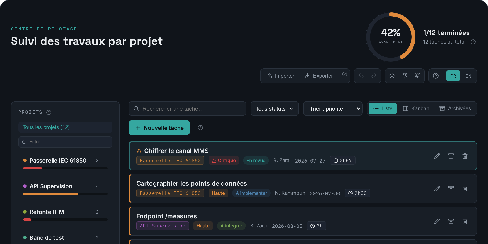
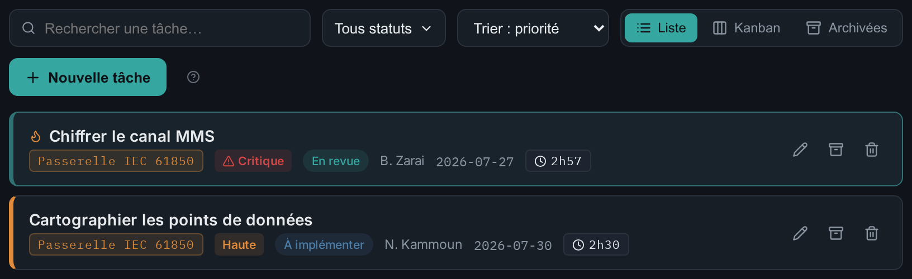
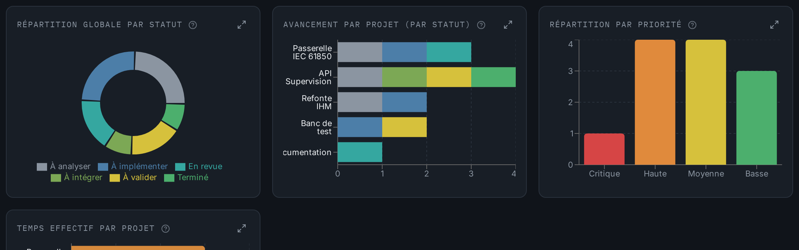
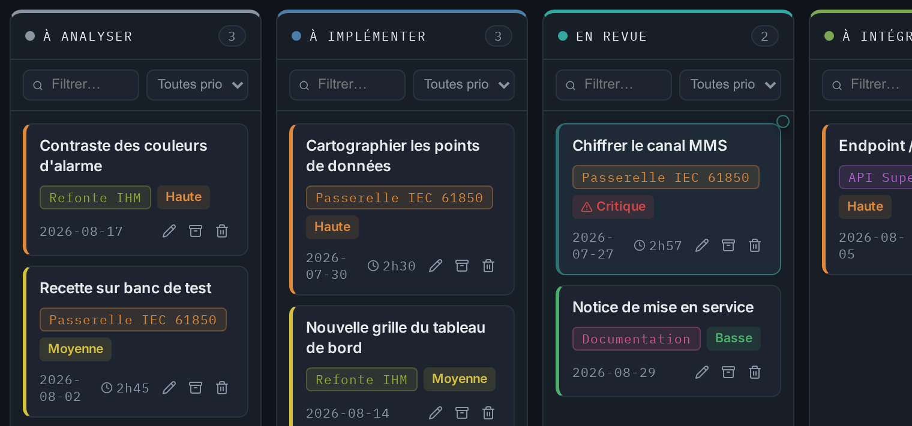
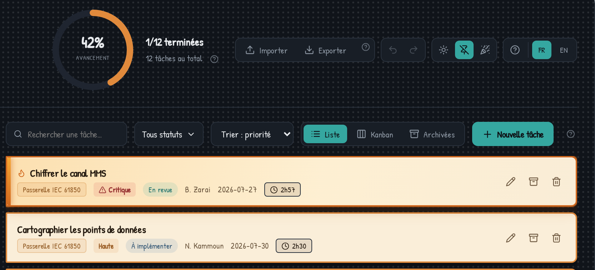

# Suivi des travaux / Work Tracker

App de bureau portable (Windows + Ubuntu) pour suivre des tâches par projet, avec échéances, priorités, temps passé et tableaux de bord.
Portable desktop app (Windows + Ubuntu) to track tasks by project, with due dates, priorities, time tracking and dashboards.

[Français](#français) · [English](#english)

## Screenshots

<!--
Regenerated from the app itself (same captures as the in-app getting-started
guide, see src/assets/tutorial/). Drop replacements in docs/screenshots/ with
these exact names and they show up here automatically.
-->

| Dashboard | Task list | Charts |
|---|---|---|
|  |  |  |

| Kanban | Sticky-note mode |
|---|---|
|  |  |

---

## Français

Cette app tourne en Electron. Le code du dashboard (`src/App.jsx`) est
exactement celui de l'artifact — seul le stockage change : au lieu du
`window.storage` de Claude, un petit fichier `data/store.json` est écrit
juste à côté de l'exécutable, ce qui la rend portable sur ta clé/SSD externe.

### Fonctionnalités

- Suivi de tâches par projet, avec priorités, échéances et statut
- Vue liste (avec pagination) et vue kanban avec glisser-déposer entre colonnes
- Archivage des tâches, avec vue « Archivées » dédiée (hors avancement et graphiques)
- Annuler / rétablir (Ctrl+Z / Ctrl+Y) sur les 100 dernières actions
- Recherche instantanée insensible aux accents/majuscules, filtres par statut et priorité
- Zone de focus : une tâche à la fois, temps pointé automatiquement
- Éditeur de description Texte / Formaté (gras, titres, listes, tableaux, couleurs, images collées)
- Vue gantt cliquable et graphiques (répartition par statut, projet, priorité, temps passé), agrandissables en plein écran
- Thème clair / sombre / aléatoire, plus un mode « post-it » superposable
- Sélecteur de langue intégré (FR/EN)
- Guide de démarrage illustré (une capture d'écran par fonctionnalité, FR/EN), rejouable via le « ? » de l'en-tête
- Animation de célébration (avec son) quand toutes les tâches sont terminées — plusieurs variantes aléatoires, dont une variante légendaire rare (1/1000)
- Stockage local en fichier JSON, portable sur clé USB / SSD externe
- Export / import de toutes les données en un seul fichier JSON

### 0. Pré-requis (une seule fois, sur chaque OS où tu vas *builder*)

- Node.js LTS (18+) : https://nodejs.org
- Sur Ubuntu, si tu veux aussi générer le `.exe` Windows depuis Ubuntu : `sudo apt install wine`

### 1. Installer les dépendances

Dans le dossier du projet :

```bash
npm install
```

Ça télécharge Electron, Vite, React, recharts, lucide-react (nécessite internet,
une seule fois).

### 2. Construire les exécutables portables

#### Option A — builder séparément sur chaque OS (le plus simple, pas besoin de wine)

Sous Ubuntu (dans ce dual-boot) :
```bash
npm run dist:linux
```
→ produit `release/SuiviTravaux-Linux.AppImage`

Sous Windows (même dual-boot, redémarre côté Windows, réinstalle Node.js et `npm install` à nouveau) :
```bash
npm run dist:win
```
→ produit `release/SuiviTravaux-Windows.exe`

#### Option B — tout construire d'un coup depuis Ubuntu (avec wine installé)

```bash
npm run dist:all
```
→ produit les deux fichiers en une seule commande.

#### Option C — tout construire dans Docker (sans installer wine)

```bash
npm run dist:docker
```
→ construit l'image `suivi-travaux-builder` (basée sur
`electronuserland/builder:wine`), lance le build dedans et récupère les deux
exécutables dans `release/`. Seul Docker est nécessaire sur la machine hôte.

### 3. Installer sur le SSD externe

Formate le SSD externe en **exFAT** (lisible/écrivable nativement par Windows
ET Ubuntu — évite NTFS en écriture côté Linux et ext4 illisible côté Windows).

Sur le SSD, crée un dossier, par exemple `SuiviTravaux/`, et mets-y :
```
SuiviTravaux/
├── SuiviTravaux-Windows.exe
└── SuiviTravaux-Linux.AppImage
```

Les deux exécutables créeront chacun un sous-dossier `data/` à côté d'eux au
premier lancement. Comme les deux fichiers sont dans le même dossier, **les
deux OS peuvent utiliser le même dossier `data/`** si tu le souhaites : tes
tâches saisies sous Ubuntu seront visibles sous Windows et vice-versa, tant
que tu ouvres l'app depuis ce même dossier sur le SSD.

### À propos du dossier `data/`

- **Windows (.exe portable)** : `data/` est créé juste à côté de l'exécutable.
- **Ubuntu (AppImage)** : `data/` est créé à côté du fichier `.AppImage` lui-même
  (l'app détecte le vrai emplacement même si AppImage se monte temporairement
  dans `/tmp` au lancement).
- Si cet emplacement n'est pas accessible en écriture (SSD monté en lecture
  seule, permissions), l'app se rabat automatiquement sur le dossier
  utilisateur standard (`~/.config/SuiviTravaux` sous Linux,
  `%APPDATA%/SuiviTravaux` sous Windows) — dans ce cas les données ne seront
  plus partagées entre les deux OS.

### 4. Lancer l'app

- **Windows** : double-clique sur `SuiviTravaux-Windows.exe`. Rien à installer,
  ça s'exécute directement depuis le SSD.
- **Ubuntu** : rends le fichier exécutable une fois (`chmod +x
  SuiviTravaux-Linux.AppImage`), puis double-clique ou lance
  `./SuiviTravaux-Linux.AppImage`.

### Développement / tests avant de builder

```bash
npm run dev
```
Lance juste le rendu web (dans le navigateur, sans Electron) pour itérer vite
sur le visuel — le stockage fichier ne fonctionne que dans l'app Electron
buildée (`npm start` lance Electron avec le vrai stockage).

### Regénérer les captures du guide de démarrage

Le guide (bouton « ? » de l'en-tête) illustre chaque fonctionnalité avec une
capture d'écran embarquée (`src/assets/tutorial/<langue>/<étape>.webp`). Après
une modif visuelle, relance la chaîne décrite en tête de
[scripts/tutorial-shots.mjs](scripts/tutorial-shots.mjs) (Vite en dev +
Playwright), sinon le guide montre une version périmée de l'app.

### Export / import des données

Les boutons **Importer** / **Exporter** en haut de l'app (à côté du sélecteur
de langue) permettent de sauvegarder ou restaurer toutes les tâches et
projets dans un unique fichier `.json`, via les boîtes de dialogue natives
de l'OS.

- **Exporter** : ouvre une boîte de dialogue "Enregistrer sous" pour choisir
  où écrire le fichier (nom par défaut : `suivi-travaux-AAAA-MM-JJ.json`).
- **Importer** : ouvre une boîte de dialogue "Ouvrir", lit le fichier choisi,
  puis demande confirmation avant de **remplacer entièrement** les tâches et
  projets actuels (action irréversible — pense à exporter d'abord si tu veux
  garder une copie de l'état courant).

Utile pour transférer les données entre les deux exécutables (Windows /
Ubuntu) sans partager le même dossier `data/`, ou pour faire une sauvegarde
ponctuelle avant une modification importante.

### Modifier le dashboard plus tard

`src/App.jsx` n'est plus que la coquille de composition ; les fonctionnalités
vivent dans `src/features/` (voir [ARCHITECTURE.md](ARCHITECTURE.md)). Après
une modif, il suffit de refaire `npm run dist:win` / `npm run dist:linux`
pour régénérer les exécutables.

---

## English

This app runs on Electron. The dashboard code (`src/App.jsx`) is exactly the
one from the artifact — only the storage changes: instead of Claude's
`window.storage`, a small `data/store.json` file is written right next to the
executable, which makes it portable on your USB key / external SSD.

### Features

- Task tracking per project, with priorities, due dates and status
- List view (with pagination) and kanban view with drag & drop between columns
- Task archiving, with a dedicated "Archived" view (excluded from progress and charts)
- Undo / redo (Ctrl+Z / Ctrl+Y) over the last 100 actions
- Instant accent/case-insensitive search, plus status and priority filters
- Focus zone: one task at a time, time tracked automatically
- Text / Formatted description editor (bold, headings, lists, tables, colors, pasted images)
- Clickable Gantt view and charts (breakdown by status, project, priority, time spent), expandable to full screen
- Light / dark / random theme, plus a "sticky note" mode on top of any of them
- Built-in language switcher (FR/EN)
- Illustrated getting-started guide (one screenshot per feature, FR/EN), replayable from the header "?"
- Celebration animation (with sound) when every task is done — several random variants, including a rare legendary one (1/1000)
- Local JSON file storage, portable on a USB key / external SSD
- Export / import of all data as a single JSON file

### 0. Prerequisites (once, on each OS you'll *build* on)

- Node.js LTS (18+): https://nodejs.org
- On Ubuntu, if you also want to generate the Windows `.exe` from Ubuntu: `sudo apt install wine`

### 1. Install dependencies

In the project folder:

```bash
npm install
```

This downloads Electron, Vite, React, recharts, lucide-react (requires
internet, only once).

### 2. Build the portable executables

#### Option A — build separately on each OS (simplest, no wine needed)

On Ubuntu (in this dual-boot):
```bash
npm run dist:linux
```
→ produces `release/SuiviTravaux-Linux.AppImage`

On Windows (same dual-boot, reboot into Windows, reinstall Node.js and
`npm install` again):
```bash
npm run dist:win
```
→ produces `release/SuiviTravaux-Windows.exe`

#### Option B — build everything at once from Ubuntu (with wine installed)

```bash
npm run dist:all
```
→ produces both files with a single command.

#### Option C — build everything in Docker (no wine to install)

```bash
npm run dist:docker
```
→ builds the `suivi-travaux-builder` image (based on
`electronuserland/builder:wine`), runs the build inside it and drops both
executables in `release/`. Docker is the only requirement on the host.

### 3. Install on the external SSD

Format the external SSD as **exFAT** (natively readable/writable by both
Windows and Ubuntu — avoids NTFS write issues on Linux and unreadable ext4 on
Windows).

On the SSD, create a folder, e.g. `SuiviTravaux/`, and put in it:
```
SuiviTravaux/
├── SuiviTravaux-Windows.exe
└── SuiviTravaux-Linux.AppImage
```

Each executable will create its own `data/` subfolder next to itself on first
launch. Since both files live in the same folder, **both OSes can share the
same `data/` folder** if you want: tasks entered under Ubuntu will be visible
under Windows and vice versa, as long as you open the app from that same
folder on the SSD.

### About the `data/` folder

- **Windows (portable .exe)**: `data/` is created right next to the
  executable.
- **Ubuntu (AppImage)**: `data/` is created next to the `.AppImage` file
  itself (the app detects the real location even though the AppImage is
  temporarily mounted under `/tmp` at launch).
- If that location isn't writable (SSD mounted read-only, permissions), the
  app automatically falls back to the standard user folder
  (`~/.config/SuiviTravaux` on Linux, `%APPDATA%/SuiviTravaux` on Windows) —
  in that case data will no longer be shared between the two OSes.

### 4. Launch the app

- **Windows**: double-click `SuiviTravaux-Windows.exe`. Nothing to install,
  it runs directly from the SSD.
- **Ubuntu**: make the file executable once (`chmod +x
  SuiviTravaux-Linux.AppImage`), then double-click it or run
  `./SuiviTravaux-Linux.AppImage`.

### Development / testing before building

```bash
npm run dev
```
Just launches the web render (in the browser, without Electron) to iterate
quickly on the visuals — file storage only works in the built Electron app
(`npm start` launches Electron with real storage).

### Regenerating the getting-started screenshots

The guide (header "?" button) illustrates each feature with a bundled
screenshot (`src/assets/tutorial/<lang>/<step>.webp`). After a visual change,
re-run the pipeline documented at the top of
[scripts/tutorial-shots.mjs](scripts/tutorial-shots.mjs) (Vite dev server +
Playwright), otherwise the guide shows a stale version of the app.

### Data export / import

The **Import** / **Export** buttons at the top of the app (next to the
language switcher) let you back up or restore all tasks and projects into a
single `.json` file, using the OS's native file dialogs.

- **Export**: opens a "Save as" dialog to choose where to write the file
  (default name: `suivi-travaux-YYYY-MM-DD.json`).
- **Import**: opens an "Open" dialog, reads the chosen file, then asks for
  confirmation before **fully replacing** the current tasks and projects
  (irreversible — export first if you want to keep a copy of the current
  state).

Useful for moving data between the two executables (Windows / Ubuntu)
without sharing the same `data/` folder, or for a one-off backup before a
big change.

### Editing the dashboard later

`src/App.jsx` is only the composition shell now; the features live in
`src/features/` (see [ARCHITECTURE.md](ARCHITECTURE.md)). After a change,
just re-run `npm run dist:win` / `npm run dist:linux` to regenerate the
executables.
